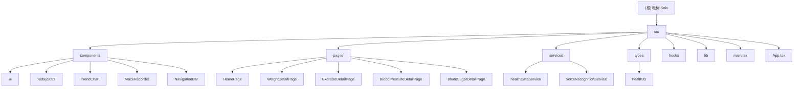

<!-- OPENSPEC:START -->
# OpenSpec Instructions

These instructions are for AI assistants working in this project.

Always open `@/openspec/AGENTS.md` when the request:
- Mentions planning or proposals (words like proposal, spec, change, plan)
- Introduces new capabilities, breaking changes, architecture shifts, or big performance/security work
- Sounds ambiguous and you need the authoritative spec before coding

Use `@/openspec/AGENTS.md` to learn:
- How to create and apply change proposals
- Spec format and conventions
- Project structure and guidelines

Keep this managed block so 'openspec update' can refresh the instructions.

<!-- OPENSPEC:END -->

# 吃树（Solo）- AI 助手开发指南

## 变更记录 (Changelog)

- **2025-11-16**: 创建完整的 CLAUDE.md 文档，包含项目架构、开发流程和技术栈信息

## 项目愿景

吃树（Solo）是一个个人健康管理应用，主要目标是通过语音识别技术帮助用户快速记录健康数据（体重、血压、血糖、运动、睡眠），提供直观的数据可视化和个人健康趋势分析。

## 架构总览

### 技术架构
- **前端框架**: React 18 + TypeScript 5
- **构建工具**: Vite 6 + PostCSS
- **样式方案**: Tailwind CSS 3 + tailwind-merge + clsx
- **路由**: React Router DOM 7
- **状态管理**: Zustand 5
- **UI 组件**: Lucide React 图标库
- **代码质量**: ESLint 9 + TypeScript ESLint
- **部署**: Vercel

### 模块结构图



## 模块索引

| 模块 | 路径 | 职责 | 主要文件 |
|------|------|------|----------|
| **核心路由** | `src/App.tsx` | 应用主路由和布局 | React Router 配置，导航栏集成 |
| **主页模块** | `src/pages/HomePage.tsx` | 今日概览和语音记录 | 聚合所有健康数据展示组件 |
| **健康数据服务** | `src/services/healthDataService.ts` | 数据持久化管理 | localStorage 单例模式 |
| **语音识别服务** | `src/services/voiceRecognitionService.ts` | 语音转文字和解析 | Web Speech API 集成 |
| **UI 组件库** | `src/components/ui/` | 可复用界面组件 | Sketch 风格组件（Button、Input、Card等） |
| **数据类型定义** | `src/types/health.ts` | TypeScript 类型系统 | 健康记录和语音结果接口 |
| **详情页模块** | `src/pages/` | 各类健康数据详情 | 体重、运动、血压、血糖页面 |

## 常用开发命令

### 开发环境
```bash
# 安装依赖
npm install

# 启动开发服务器
npm run dev

# 类型检查（不生成文件）
npm run check

# 代码检查
npm run lint
```

### 构建和部署
```bash
# 构建生产版本
npm run build

# 预览构建结果
npm run preview
```

## 开发工作流和约定

### 代码组织原则
1. **组件设计**: 使用函数组件 + Hooks，避免类组件
2. **样式方案**: 优先使用 Tailwind CSS，复杂样式结合 `tailwind-merge` 和 `clsx`
3. **路径别名**: 使用 `@/*` 别名引用 `src/` 下的文件
4. **状态管理**: 简单状态使用 `useState`，复杂状态使用 Zustand
5. **类型安全**: 严格的 TypeScript 配置，所有 props 需要类型定义

### 文件命名约定
- **组件**: PascalCase（如 `TodayStats.tsx`）
- **服务**: camelCase（如 `healthDataService.ts`）
- **类型**: camelCase（如 `health.ts`）
- **工具函数**: camelCase（如 `utils.ts`）
- **Hook**: camelCase 以 `use` 开头（如 `useTheme.ts`）

### Git 工作流
1. 功能分支从 `main` 创建
2. 提交前运行 `npm run lint` 和 `npm run check`
3. 推送到远程后 Vercel 自动部署

## 测试策略

⚠️ **当前状态**: 项目目前暂无测试配置

**建议测试配置**:
```bash
# 推荐添加的依赖
npm install -D @testing-library/react @testing-library/jest-dom vitest @vitest/ui jsdom
```

**测试目录结构**:
```
src/
  __tests__/          # 组件测试
  components/
    __tests__/        # 组件单元测试
  services/
    __tests__/        # 服务层测试
```

## 部署和发布

### Vercel 部署
- **自动部署**: 推送到 `main` 分支自动触发
- **构建配置**: Vite 预设，构建命令 `npm run build`
- **输出目录**: `dist`
- **环境变量**: 目前无敏感环境变量

### 生产优化
- **代码分割**: Vite 自动处理
- **资源优化**: 图片和字体资源优化
- **Source Map**: 生产环境隐藏源码映射

## 重要配置文件

### TypeScript 配置 (`tsconfig.json`)
- **目标**: ES2020
- **模块**: ESNext
- **严格模式**: 已关闭（开发友好）
- **路径别名**: `@/*` 映射到 `./src/*`

### Vite 配置 (`vite.config.ts`)
- **插件**: React + TypeScript 路径 + Trae Badge
- **Source Map**: 生产环境隐藏
- **开发定位**: Babel react-dev-locator 插件

### ESLint 配置 (`eslint.config.js`)
- **规则**: 推荐的 TypeScript 和 React 规则
- **插件**: React Hooks + React Refresh
- **忽略**: `dist` 目录

## 数据模型

### 健康记录类型
```typescript
// 核心健康数据类型
WeightRecord | BloodPressureRecord | BloodSugarRecord | ExerciseRecord | SleepRecord

// 统一记录格式
HealthRecord {
  id: string
  type: HealthRecordType
  data: 具体记录类型
  timestamp: number
}
```

### 数据持久化
- **存储方案**: localStorage
- **服务模式**: 单例模式（`HealthDataService.getInstance()`）
- **数据格式**: JSON 序列化

## AI 使用指引

### 开发辅助
1. **组件开发**: 优先使用现有 UI 组件库组件
2. **状态管理**: 简单状态用 useState，复杂状态考虑 Zustand
3. **样式实现**: 遵循现有的 Sketch 风格设计系统
4. **类型定义**: 使用 `src/types/health.ts` 中的现有类型

### 代码生成模板
```typescript
// 新组件模板
import React from 'react'
import { twMerge } from 'tailwind-merge'

type Props = {
  // 定义 props
}

export function ComponentName({ ...props }: Props) {
  return (
    <div className={twMerge('base-styles', className)}>
      {/* 组件内容 */}
    </div>
  )
}
```

### 常见开发任务
- **添加新的健康数据类型**: 更新 `health.ts` 类型定义，扩展服务层
- **创建新的详情页**: 参考 `WeightDetailPage.tsx` 模式
- **UI 组件开发**: 使用 `src/components/ui/` 中的 Sketch 组件风格
- **路由添加**: 在 `App.tsx` 中添加新路由和导航项

## 相关文件清单

### 核心应用文件
- `src/main.tsx` - 应用入口
- `src/App.tsx` - 主路由配置
- `src/index.css` - Tailwind 样式入口

### 配置文件
- `vite.config.ts` - Vite 构建配置
- `tsconfig.json` - TypeScript 配置
- `eslint.config.js` - 代码检查配置
- `tailwind.config.js` - Tailwind 配置
- `postcss.config.js` - PostCSS 配置

### 包管理
- `package.json` - 项目依赖和脚本
- `package-lock.json` - 锁定版本

### 部署相关
- `.vercel/project.json` - Vercel 部署配置
- `.gitignore` - Git 忽略规则